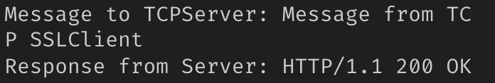

# Cryptography

> DAT159

By Sondre Gjellestad and Arne Molland

## Task 1

After setting up the certificate, the connection works.

## Task 3

Here is the result in WireShark.

## Task 4 | Tamper with the Message (Integrity)

After setting up the proxy certificates, we've set a breakpoint like this:

After tampering with the message this is the response from the server.

## Question

Can we impersonate HttpsClientProxySSLRSA in this setup? If so, we would need it's private key in order to sign messages correctly.
